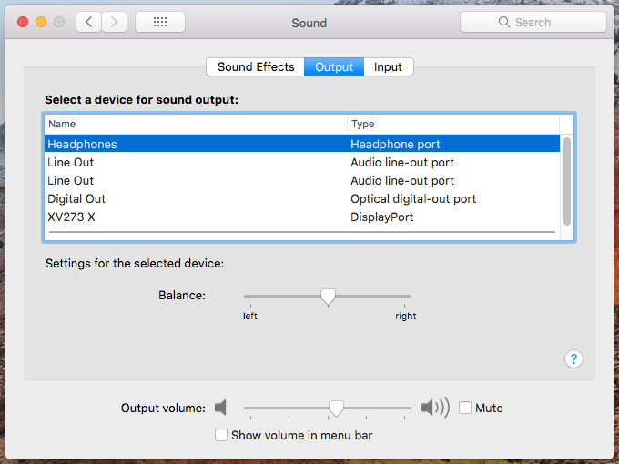

# MSI MPG Z490 GAMING PLUS OpenCore EFI

EFI for **MSI MPG Z490 GAMING PLUS** motherboard, supporting **Mac OS X High Sierra** and **Comet Lake**.<br>
[OpenCore](https://dortania.github.io/OpenCore-Install-Guide/) **v0.7.8**.

## Warning!
If you aren't using **High Sierra**, this EFI is not for you!

## Why Mac OS X 10.13?
Mac OS X High Sierra is the latest version to **support NVIDIA Drivers**.

## Working:
- [X] Ethernet
- [X] Audio
- [X] Microphone
- [X] NVIDIA Drivers
- [X] USB ports

## Not Working
- iGPU

## Fix Ethernet
If you don't have internet connection, try this command:
```ifconfig en0 media 1000baseT```

## SMBIOS
iMac18,3

## Useful links
- https://dortania.github.io/OpenCore-Install-Guide/installer-guide/
- https://www.tonymacx86.com/nvidia-drivers/

## Screenshots

### Desktop


### System information


### Sound information


### NVIDIA information
